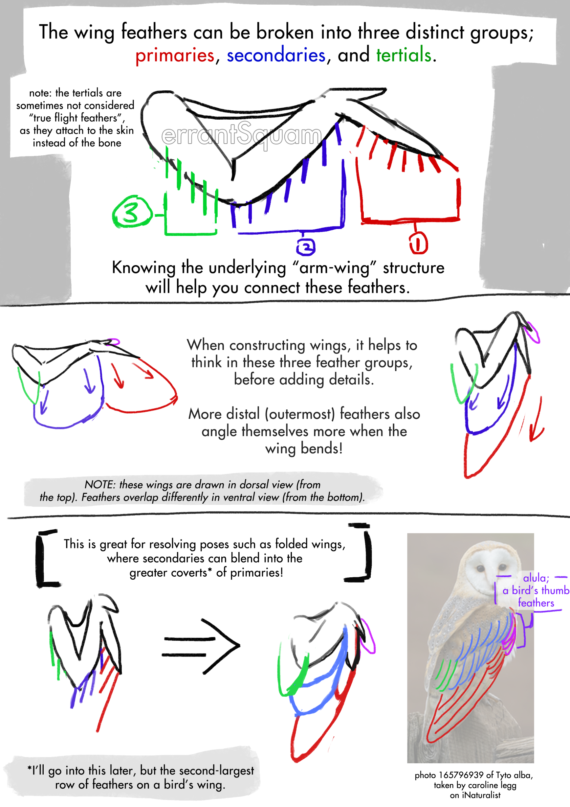
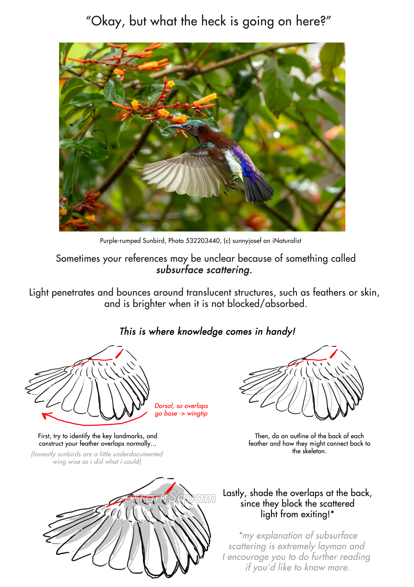

## Table of Contents

# Foreword
Hello! Big page here. I'll try to optimize it eventually, but for now it's a repository for the bird tutorials.

[Back to main page](/)

# 01 - Structure and Function

# 02 - Primaries, Secondaries, and Tertials

# 03 - Wing Overlaps

